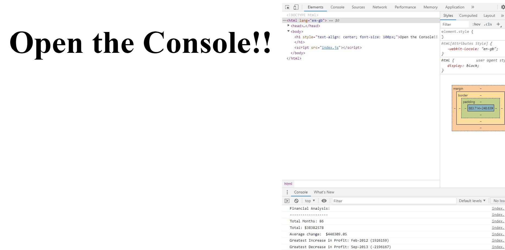
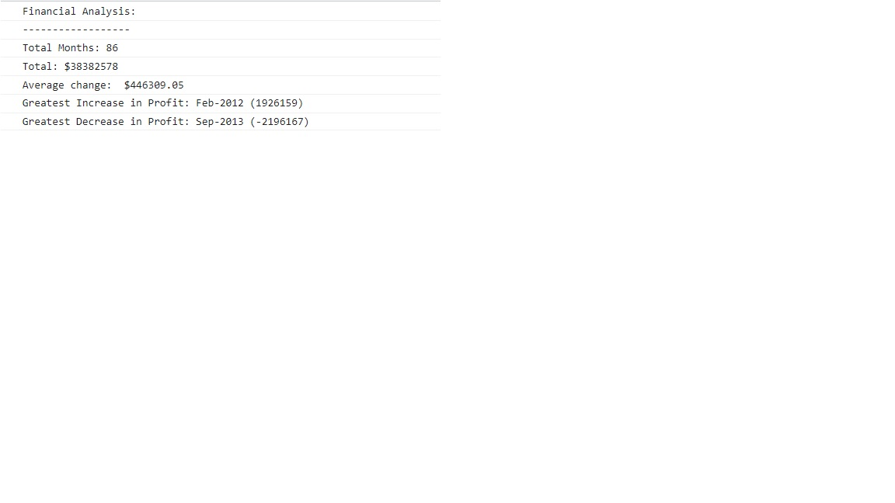

# Console-Finances
## Description
In this poject I've created an algorithm for analyzing a finanacial dataset for a company

The company gave us a dataset from a few months and I have to write JavaScript code that analyzes the records to calculate the following:

  - Total Months: 
  - Total: 
  - Average  Change: 
  - Greatest Increase in Profits:
  - Greatest Decrease in Profits:

I have used for loop to iterate through the dataset(array) and if staments.

## Usage

Application screenshot:

Console screenshot:

Deployed application link: 

## Credits

I used the following tutorials:

JavaScript fundamentals: https://javascript.info/first-steps

JavaScript basics: https://developer.mozilla.org/en-US/docs/Learn/Getting_started_with_the_web/JavaScript_basics

How to write Pseudocode: A beginner’s guide: https://medium.com/@ngunyimacharia/how-to-write-pseudocode-a-beginners-guide-29956242698
